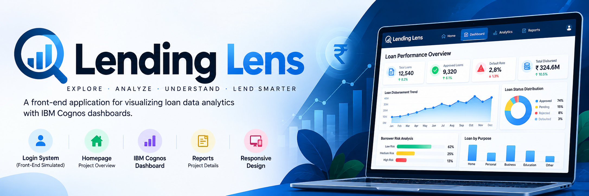
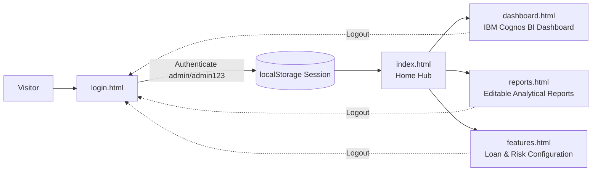

<div align="center">

  

  # 🔍 Lending Lens
  ### *Intelligent Loan Analytics & Risk Assessment BI Platform*

  <p align="center">
    A data-driven Business Intelligence (BI) web application designed to evaluate loan applicants, forecast approval trends, assess borrower credit risks, and optimize financial decision-making through embedded IBM Cognos analytics.
  </p>

  <p align="center">
    
    
    
    
    
    
  </p>

</div>

---

## 📑 Table of Contents

- [📌 Overview](#-overview)
- [✨ Key Features](#-key-features)
- [🖥️ System Previews](#️-system-previews)
- [🧭 Application Architecture & Workflow](#-application-architecture--workflow)
- [🛠️ Tech Stack](#️-tech-stack)
- [🔐 Demo Authentication](#-demo-authentication)
- [🚀 Quick Start & Installation](#-quick-start--installation)
- [📂 Project Structure](#-project-structure)
- [📊 Business Intelligence Highlights](#-business-intelligence-highlights)
- [🤝 Contributing](#-contributing)
- [📄 License](#-license)
- [👤 Author & Contact](#-author--contact)

---

## 📌 Overview

**Lending Lens** is an interactive financial intelligence dashboard engineered to empower credit analysts, loan officers, and financial institutions with real-time risk evaluation and lending portfolio metrics. 

By unifying client-side web technologies with **IBM Cognos Analytics**, the platform ingests and explores loan applicant portfolios across multiple financial dimensions—including **credit score distribution, debt-to-income (DTI) ratios, loan approval probabilities, income verification, and default risk**.

### Why Lending Lens?
- 🎯 **Data-Driven Credit Decisions**: Eliminates guesswork by visualizing applicant risk tiers and approval probabilities.
- ⚡ **Zero-Setup Lightweight Deployment**: Runs directly in the browser with no backend or database server configuration required.
- 📈 **Executive BI Delivery**: Pairs high-level KPIs with interactive drill-down reports and configuration toggles.

---

## ✨ Key Features

<table>
  <tr>
    <td width="50%">
      <h3>📈 Embedded Cognos BI Dashboard</h3>
      <ul>
        <li>Real-time interactive dashboard powered by <b>IBM Cognos Analytics</b>.</li>
        <li>Visualizes applicant loan amounts, approvals, rejection ratios, and repayment risk.</li>
        <li>Full-screen iframe integration with dynamic responsiveness.</li>
      </ul>
    </td>
    <td width="50%">
      <h3>🔐 Simulated Authentication Flow</h3>
      <ul>
        <li>Client-side credential verification with session caching in <code>localStorage</code>.</li>
        <li>Route guard mechanics protecting Dashboard, Reports, and Feature portals.</li>
        <li>Seamless single-click logout and state restoration.</li>
      </ul>
    </td>
  </tr>
  <tr>
    <td width="50%">
      <h3>📋 Interactive Project Reports</h3>
      <ul>
        <li>Accordion-style breakdown covering <i>Executive Summary</i>, <i>Methodology</i>, and <i>Approval Trends</i>.</li>
        <li><b>Live Editable Mode</b>: Toggle <code>contenteditable</code> inline documentation updates on the fly.</li>
        <li>Structured analytical findings based on loan applicant metrics.</li>
      </ul>
    </td>
    <td width="50%">
      <h3>⚙️ Feature & Risk Management Hub</h3>
      <ul>
        <li><b>Loan Product Settings</b>: Configure rates and tenure for Personal, Business, & Home loans.</li>
        <li><b>Custom Risk Rules</b>: Define credit score cutoffs and maximum DTI thresholds.</li>
        <li><b>Feature Toggles</b>: Enable/disable promotional programs and modular features dynamically.</li>
      </ul>
    </td>
  </tr>
</table>

---

## 🖥️ System Previews

<div align="center">
  <h3>📊 IBM Cognos Embedded Analytics View</h3>
  
</div>

---

## 🧭 Application Architecture & Workflow



---

## 🛠️ Tech Stack

| Layer | Technology | Description |
| :--- | :--- | :--- |
| **Frontend Core** | `HTML5`, `CSS3` | Semantic markup, custom styling, glassmorphism, and responsive grid layouts |
| **Scripting & Logic** | `JavaScript (ES6+)` | Client-side routing, auth simulation, UI interactions, and session handling |
| **CSS Framework** | `Bootstrap 5.3` | Grid system, responsive utility classes, navigation bars, and collapsible accordions |
| **Business Intelligence** | `IBM Cognos Analytics` | Embedded interactive BI dashboard reporting and data visualization |
| **Data Source** | `Microsoft Excel (.xlsx)` | Structured loan dataset containing applicant demographic and financial metrics |
| **Icons & Media** | `Font / Image Assets` | Custom visual assets, banners, and curated UI backdrops |

---

## 🔐 Demo Authentication

To test authenticated routes and explore the full suite of dashboards, use the following preconfigured test credentials:

| Field | Credentials |
| :--- | :--- |
| **Username** | `admin` |
| **Password** | `admin123` |
| **Access Level** | Full Administrator (Access to Dashboard, Reports, Features) |

> ℹ️ *Tip: Authentication status is persisted in your browser's `localStorage`.*

---

## 🚀 Quick Start & Installation

Because **Lending Lens** is purely client-side, running it locally requires no build step, Node.js packages, or web server setup!

### Option 1: Direct File Launch
1. **Clone the repository:**
   ```bash
   git clone https://github.com/Aakash02A/BI-Lending-Lens.git
   ```
2. **Navigate into the project directory:**
   ```bash
   cd BI-Lending-Lens
   ```
3. **Launch the application:**
   - Double-click [`index.html`](index.html) or open it directly in any modern browser (Chrome, Edge, Firefox, Safari).

---

### Option 2: Run with VS Code Live Server
1. Open the project folder in **Visual Studio Code**.
2. Install the **Live Server** extension (`ritwickdey.liveserver`).
3. Right-click on [`index.html`](index.html) and select **"Open with Live Server"**.
4. The application will launch at `http://127.0.0.1:5500/index.html`.

---

## 📂 Project Structure

```text
BI-Lending-Lens/
│
├── Assets/
│   └── Banner.png                  # Project banner graphic
│
├── Screenshot 2025-04-20 215401.png # Cognos dashboard preview screenshot
├── lending lens .xlsx             # Underlying loan applicant dataset
│
├── index.html                      # Main home landing page & navigation hub
├── login.html                      # Authentication gateway with credential check
├── dashboard.html                  # Embedded IBM Cognos analytics dashboard
├── reports.html                    # Project report with live editable accordions
├── features.html                   # Loan management, risk rules & feature toggles
│
├── LICENSE                         # MIT License file
└── README.md                       # Repository documentation
```

---

## 📊 Business Intelligence Highlights

The underlying dataset ([`lending lens .xlsx`](lending%20lens%20.xlsx)) profiles loan applicants across core credit indicators:

- **Applicant Profiling**: Evaluation across credit score ranges, annual income tiers, and employment stability.
- **Risk Assessment**: Cross-referencing loan amounts against debt-to-income (DTI) metrics to identify high-risk exposure.
- **Approval Correlation**: Demonstrates the direct impact of credit score brackets on final loan approval rates.
- **Cognos Dashboard Embed**: Encapsulates these multidimensional insights into visual charts, interactive filters, and drill-down KPIs.

---

## 🤝 Contributing

Contributions, feedback, and suggestions are always welcome!

1. Fork the Project (`https://github.com/Aakash02A/BI-Lending-Lens/fork`)
2. Create your Feature Branch (`git checkout -b feature/AmazingFeature`)
3. Commit your Changes (`git commit -m 'Add some AmazingFeature'`)
4. Push to the Branch (`git push origin feature/AmazingFeature`)
5. Open a Pull Request

---

## 📄 License

This project is licensed under the **MIT License** - see the [LICENSE](LICENSE) file for details.

---

<div align="center">
  <sub>Built for data-driven financial analytics and clean web engineering.</sub>
</div>
